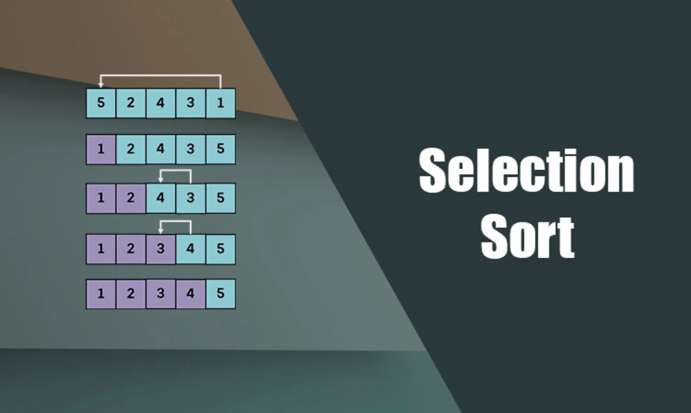

Selection Sort (Seçmeli Sıralama) algoritmasında, her bir iterasyonda en küçük eleman tespit edildiği için seçerek sıralama algoritması adını almıştır. İterasyon bittiğinde dizi değerleri içerisinden tespit edilen en küçük değer başa alınarak birinci eleman yapılır. Sonraki iterasyonlarda ise küçük sayı arama işlemine bir sonraki sayıdan (ikinci sayıdan, üçüncü sayıdan, dördüncü sayıdan,….n.sayıdan) başlanılarak küçükten büyüğe olacak şekilde sola kaydırılır. Yani önceki iterasyonda işi biten eleman sonraki iterasyonlara dahil edilmez.

Selection Sort algoritmasında dizi içerisinde gezilip en küçük eleman bulunup birinci eleman olarak işaretlenir. Daha sonra diğerlerine bakılıp en küçük tespit edilip ikinci eleman olarak işaretlenir ve bu şekilde algoritma kendisini sonlandırana kadar devam eder.

## Örnek
15,5,1,9 dizisini Selection Sort algoritması ile sıralamamız gerekirse;

1. Dizideki ilk elemanı minimum değer olarak kabul edip bu değerin dizinin tüm elemanları ile karşılaştırılmasını sağlayalım.
2. 15 değeri diğer elemanlar ile karşılaştırılır ve hemen yanındaki 5 değeri daha küçük olduğundan artık yeni mininum değer 5 olur.
3. 5 değeri dizide tüm elemanlar ile karşılaştırılır 1 değerinin daha küçük olduğu görülür ve yeni minimum değer 1 olarak devam edilir.
4. Bu şekilde tüm elemanlar kontrol edilir ve her bir iterasyonda küçük değer tespiti yapılıp sıralama yapılır. Sonra ikinci iterasyona geçilir ve aynı işlemler tekrar edilir. İşlemin sonucunda `1,5,9,15` sıralanmış dizisi elde edilir.

## Örnek Kod
```c
#include <stdio.h>
  
void swap(int *xp, int *yp)
{
    int temp = *xp;
    *xp = *yp;
    *yp = temp;
}

void selectionSort(int arr[], int n)
{
    int i, j, min_idx;
    for (i = 0; i < n-1; i++)
    {
        min_idx = i;
        for (j = i+1; j < n; j++)
          if (arr[j] < arr[min_idx])
            min_idx = j;

           if(min_idx != i)
            swap(&arr[min_idx], &arr[i]);
    }
}

void printArray(int arr[], int size)
{
    int i;
    for (i=0; i < size; i++)
        printf("%d ", arr[i]);
    printf("\n");
}

int main()
{
    int arr[] = {15, 5, 1, 9};
    int n = sizeof(arr)/sizeof(arr[0]);
    selectionSort(arr, n);
    printf("Sıralanmış Dizi: \n");
    printArray(arr, n);
}
```
